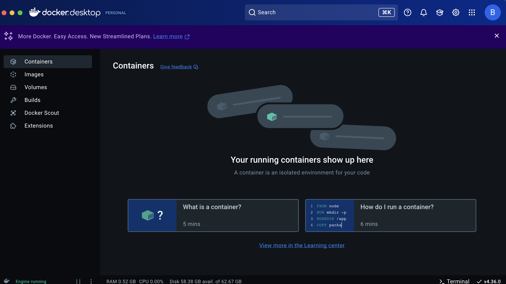

# capstone-backend

**Install docker command**
- brew install --cask docker
------------------------------

**Running the backend**
1. run the docker application in the backround and make sure it looks like this:
    

2. run these commands
    - cd docker
    - docker-compose down -v
    - docker-compose up -d
    - cd ..
    - go run main.go

---

Common Docker Commands

    View logs: docker-compose logs
    Reset database: docker-compose down -v && docker-compose up -d

Troubleshooting

    If port 5432 is already in use, stop your local PostgreSQL service:

Mac/Linux: sudo service postgresql stop or brew services stop postgresql

